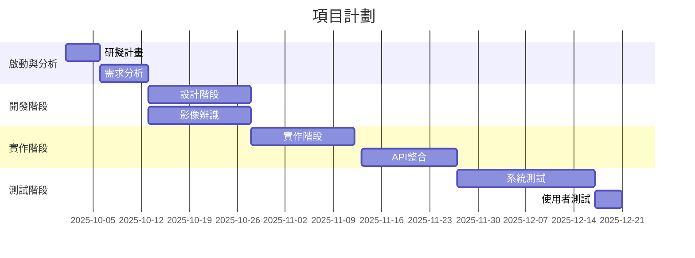
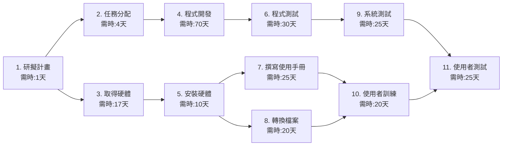

## 1.甘特圖

專案時程（2025/10/01 至 2025/12/21，約 12 週）。

```mermaid
gantt
    title 項目計劃
    dateFormat  YYYY-MM-DD
    section 啟動與分析
    研擬計畫         :2025-10-01, 5d
    需求分析         :2025-10-06, 7d
    section 開發階段
    設計階段         :2025-10-13, 15d
    影像辨識         :2025-10-13, 15d
    section 實作階段
    實作階段         :2025-10-28, 15d
    API整合         :2025-11-13, 14d
    section 測試階段
    系統測試           :2025-11-27, 20d
    使用者測試         :2025-12-17, 4d
```

## 3.PERT/CPM圖

```mermaid
graph LR
A1[1. 研擬計畫<br>需時:1天]
B2[2. 任務分配<br>需時:4天]
C3[3. 取得硬體<br>需時:17天]
D4[4. 程式開發<br>需時:70天]
E5[5. 安裝硬體<br>需時:10天]
F6[6. 程式測試<br>需時:30天]
G7[7. 撰寫使用手冊<br>需時:25天]
H8[8. 轉換檔案<br>需時:20天]
I9[9. 系統測試<br>需時:25天]
J10[10. 使用者訓練<br>需時:20天]
K11[11. 使用者測試<br>需時:25天]


A1 --> B2
A1 --> C3
B2 --> D4
C3 --> E5
D4 --> F6
E5 --> G7
E5 --> H8
F6 --> I9
G7 --> J10
H8 --> J10
I9 --> K11
J10 --> K11


```

關鍵路徑：1->2->4->6->9->11
