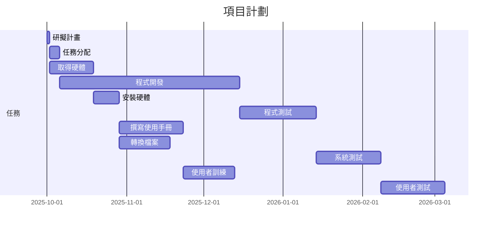
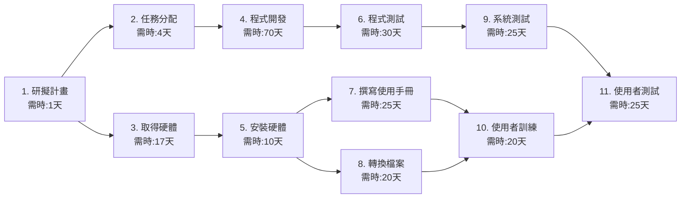

## 1.甘特圖

```mermaid
gantt
    title 項目計劃
    dateFormat  YYYY-MM-DD
    section 任務
    研擬計畫         :1a,2025-10-01, 1d
    任務分配         :2a,after 1a, 4d
    取得硬體         :3a,after 1a, 17d
    程式開發         :4a,after 2a, 70d
    安裝硬體         :5a,after 3a, 10d
    程式測試         :6a,after 4a, 30d
    撰寫使用手冊      :7a,after 5a, 25d
    轉換檔案         :8a,after 5a, 20d
    系統測試         :9a,after 6a, 25d
    使用者訓練       :10a,after 7a 8a, 20d
    使用者測試       :11a,after 9a 10a, 25d


```

## 2.PERT/CPM圖、關鍵路徑

```mermaid
graph LR
A1[1. 研擬計畫<br>需時:1天]
B2[2. 任務分配<br>需時:4天]
C3[3. 取得硬體<br>需時:17天]
D4[4. 程式開發<br>需時:70天]
E5[5. 安裝硬體<br>需時:10天]
F6[6. 程式測試<br>需時:30天]
G7[7. 撰寫使用手冊<br>需時:25天]
H8[8. 轉換檔案<br>需時:20天]
I9[9. 系統測試<br>需時:25天]
J10[10. 使用者訓練<br>需時:20天]
K11[11. 使用者測試<br>需時:25天]


A1 --> B2
A1 --> C3
B2 --> D4
C3 --> E5
D4 --> F6
E5 --> G7
E5 --> H8
F6 --> I9
G7 --> J10
H8 --> J10
I9 --> K11
J10 --> K11


```

關鍵路徑：1->2->4->6->9->11
